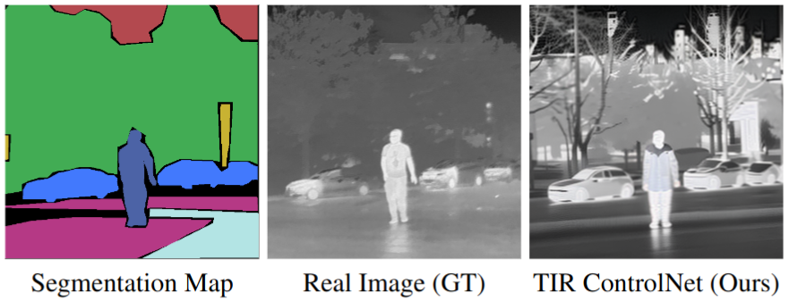

# TIR ControlNet
Christian Mayr, Christian Kübler, Norbert Haala, Michael Teutsch,**"Diffusion based Thermal Semantic Segmentation"**, Perception Beyond the Visual Spectrum Workshop **PBVS**, Computer Vision and Pattern Recognition Conference **CVPR** - 2024, **Poster**


### Image Synthesis Preview

The in the paper presented described approach for IR image synthesis based on provided semantics maps is demonstrated here.

---


 
---

## Set Up on Your Own Machine

To allow the research community to further experiment with ControlNet's ability to synthesize high quality IR data, we have decided to release our pretrained weights and inference script. This allows you to synthesize your own IR images.

#### General
A cuda capable GPU is required to run our code. There you should make sure to have to have your GPU setup correctly.

In order to make sure that this is the case, run these two commands.

```shell
nvcc -V
```
```shell
nvidia-smi
```
If there is no output you need to setup your GPU correctly. 

#### Virtual Environment

We highly recommend for you to use Conda as a package manager.

```shell
# create virtual environment
conda create -n IR_ConNet python=3.8
conda activate IR_ConNet
conda install pytorch torchvision torchaudio pytorch-cuda=12.1 -c pytorch -c nvidia
conda install -c conda-forge diffusers transformers accelerate
```

#### Pretrained weights

The pretrained weights can be downloaded from HuggingFace.
```shell
https://huggingface.co/0x434D/TIR_ControlNet
```

#### Demo images

## Usage

After setting up your virtual environment with conda and downloading the pretrained weights, you can simply use the provided inference script to run the sythesis using a given semantic map.


## Important Notes

### Grayscale
The pretrained network was trained on the grayscale semantic maps. That is, the images that directly encode the label IDs. It is critical to use this kind of semantic maps and **not** colored ones.

### Label ID convention - [FMB](https://arxiv.org/abs/2308.02097) Dataset
The provided pretrained ControlNet has been trained using the [FMB](https://arxiv.org/abs/2308.02097) dataset and and is therefore trained on the conventions contained therein for the definition of label ids. If semantic maps originating from other datasets are supposed to be processed with the provided pretrained model the IDs have to be matched to the ones in the [FMB](https://arxiv.org/abs/2308.02097) dataset.

| Label         | ID |  RGB Color     |
|---------------|----|----------------|
| unlabeled     |  0 | (  0,   0,   0)|
| Road          |  1 | (179, 228, 228)|
| Sidewalk      |  2 | (181,  57, 133)|
| Building      |  3 | ( 67, 162, 177)|
| Traffic Light |  4 | (200, 178,  50)|
| Traffic Sign  |  5 | (132,  45, 199)|
| Vegetation    |  6 | ( 66, 172,  84)|
| Sky           |  7 | (179,  73,  79)|
| Person        |  8 | ( 76,  99, 166)|
| Car           |  9 | ( 66, 121, 253)|
| Truck         | 10 | (  6,   6,   6)|
| Bus           | 11 | ( 12,  12,  12)|
| Motorcycle    | 12 | (105, 153, 140)|
| Bicycle       | 13 | (222, 215, 158)|
| Pole          | 14 | (135, 113,  90)|

### Size

Note that the pretrained network is trained using 512 by 512 images - it is advised to stick to this size to achieve the best results.


## Citation

If this work has been helpful to you, please feel free to cite our paper!

```shell

```
